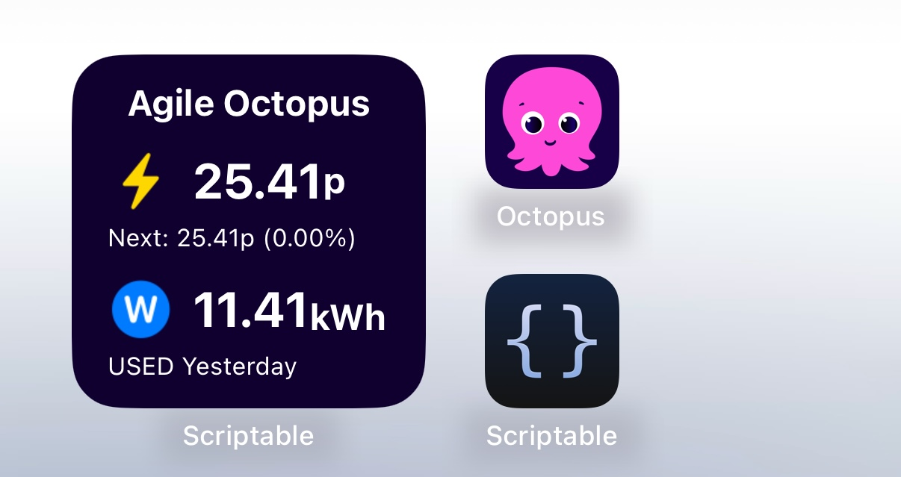
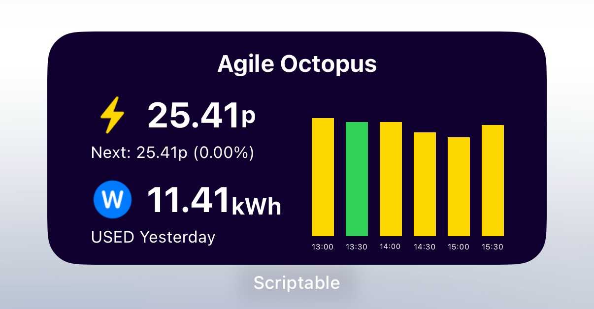

# Octopus Energy Widget for iOS

A Scriptable widget that displays Octopus Energy tariff rates and consumption data on your iOS device. This widget currently suports only electricity and Aglie Octopus Tariff for now, but please feel free to fork and tweak it to your needs!

<br>


## Features

- Displays current and upcoming Octopus Energy tariff rates
- Shows historical consumption data
- Visual price comparison graph
- Supports both small and medium widget sizes

## Prerequisites

1. iOS device
2. [Scriptable app](https://apps.apple.com/app/scriptable/id1405459188) installed
3. Octopus Energy account with API access, you can get these information from [Octopus Energy Dashboard](https://octopus.energy/dashboard/new/accounts/personal-details/api-access):
   - API key
   - MPAN number
   - Meter serial number

## Installation

1. Download the Scriptable app from the App Store
2. Create a new script in Scriptable by clicking '+' at the top right corner
3. Copy the contents of `octopusWidget.js` into your new script
4. Update the configuration section with your tarrif and account details, for example:
```
tariff: {
    key: "AGILE-24-10-01",
    type: "electricity",
    regionCode: "J",
}
```
```
api: {
    apiKey: "<YourApiKey>",
    MPAN: "<YourMPAN>",
    serialNumber: "<YourSerialNumber>"
}
```
5. Rename the script to "Octopus Energy Tariff"

## Widget Setup

1. Long press on your home screen
2. Tap the "Edit" button in the top left and select "Add Widget"
3. Search for "Scriptable"
4. Choose widget size (small or medium)
5. Add the widget
6. Long press on the widget and choose "Edit Widget"
7. Select your script and choose "Run Script"

## Widget Sizes

### Small Widget
- Current tariff rate
- Next period's rate
- Price trend indicator

### Medium Widget
- All features from small widget
- 6-hour price graph
- Historical consumption data

## Acknowledgments

- [Scriptable](https://scriptable.app/) for the widget framework
- [Octopus Energy API](https://developer.octopus.energy/) for the data
- [smalley1992.github.io](https://github.com/smalley1992/smalley1992.github.io) for inspiration